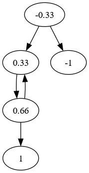

Sometimes the middle game of Go does not appoint a clear winner and the game
needs to be continued into the endgame. How to play the endgame is the subject
of this study.

The study starts by presenting a problem and its solution. It then proceeds
with the moves that were actually played. Each of the moves is then valuated.
A glossary is presented, followed by graphs of the moves that were presented
without.

\newpage

## 1.1 Not a problem

This is an endgame problem, with a twist. Normally a problem is formulated as:
Black to play and win. But in this case it does not look like black can win,
if both players play their moves in order of decreasing value.

\cleargoban
\gobansize{13}
\black{a3,a6,a9,a11,b1,b2,b4,b6,b10,b11,b12,c2,c3,c6,d2,d3,d6,d7,d8,d9,d10,d11,d12,d13,e2,e6,e9,e11,f2,f3,f4,f7,f9,f11,g6,g7,g9,g12,h7,h8,h9,j1,j7,j9,k2,k8,k11,k12,l2,l3,l4,l11,m2,m4,m5,m6,m7,m11,m13,n6,n12}
\white{a5,a7,a8,a12,b5,b7,b9,b13,c4,c5,c7,c8,c9,c10,c11,c12,c13,d3,d5,e3,e4,e5,f5,g2,g4,g5,g10,g11,h2,h3,h4,h6,h11,j2,j5,j10,j11,j12,k3,k4,k5,k6,k7,k9,k10,l1,l6,l8,l10,m7,m10,n7,n10,n11,m1}
\largegoban\showgoban

Black to move, Japanese rules, *komi* 6.5, black has 2 prisoners.

\newpage

## 1.2 Move sequence

The largest move would normally be located at 4, counting as one point *sente*.
However, in this case black has an abundance of *ko* threats in the upper left
part of the board, causing this location to be *gote*. That is why blacks first
move is elsewhere.

\cleargoban
\gobansize{13}
\black{a3,a6,a9,a11,b1,b2,b4,b6,b10,b11,b12,c2,c3,c6,d2,d3,d6,d7,d8,d9,d10,d11,d12,d13,e2,e6,e9,e11,f2,f3,f4,f7,f9,f11,g6,g7,g9,g12,h7,h8,h9,j1,j7,j9,k2,k8,k11,k12,l2,l3,l4,l11,m2,m4,m5,m6,m7,m11,m13,n6,n12}
\white{a5,a7,a8,a12,b5,b7,b9,b13,c4,c5,c7,c8,c9,c10,c11,c12,c13,d3,d5,e3,e4,e5,f5,g2,g4,g5,g10,g11,h2,h3,h4,h6,h11,j2,j5,j10,j11,j12,k3,k4,k5,k6,k7,k9,k10,l1,l6,l8,l10,m7,m10,n7,n10,n11,m1}
\black[1]{k13,h12,g13,a4,f1,j6,f10,h1,k1,h13,f12,g1,b3,g3,l5,f6,h10,j13}
\largegoban\showgoban

Black fills the last *ko*. Even though black has many *ko* threats in the
upper left, he is required to fill this empty point, because there is a rule
that states that direct *ko*'s must be connected, unless they are part of a
*seki*. The empty point in a *seki* does not cause a problem, because in a
*seki* no points are counted as territory.

The breakdown of territories shows a win for white by 0.5 points.

+-------------+------+--------------+-----+
| White       | 29.5 + Black        | 29  |
+-------------+------+--------------+-----+
| upper left\ | 13\  | upper left\  |  8\ |
| bottom\     | 10\  | upper right\ |  4\ |
| komi        | 6.5  | lower left\  |  5\ |
|             |      | lower right\ | 10\ |
|             |      | prisoners    |  2  |
+-------------+------+--------------+-----+

White can do a little better by starting the *ko* at 13 instead of occupying a
neutral point at 12. There are two *ko*'s on the board and black cannot win
both. But what is the point? White already secures a win without capturing a
*ko*.

\newpage

## 1.3 Prediction

The question is whether the result can be predicted at the start, without
putting any stones on the board.

\cleargoban
\gobansize{13}
\black{a3,a6,a9,a11,b1,b2,b4,b6,b10,b11,b12,c2,c3,c6,d2,d3,d6,d7,d8,d9,d10,d11,d12,d13,e2,e6,e9,e11,f2,f3,f4,f7,f9,f11,g6,g7,g9,g12,h7,h8,h9,j1,j7,j9,k2,k8,k11,k12,l2,l3,l4,l11,m2,m4,m5,m6,m7,m11,m13,n6,n12}
\white{a5,a7,a8,a12,b5,b7,b9,b13,c4,c5,c7,c8,c9,c10,c11,c12,c13,d3,d5,e3,e4,e5,f5,g2,g4,g5,g10,g11,h2,h3,h4,h6,h11,j2,j5,j10,j11,j12,k3,k4,k5,k6,k7,k9,k10,l1,l6,l8,l10,m7,m10,n7,n10,n11,m1}
\gobansymbol{k13}{A}
\gobansymbol{f10}{B}
\gobansymbol{j8}{C}
\gobansymbol{j6}{D}
\gobansymbol{a4}{E}
\gobansymbol{f1}{F}
\largegoban\showgoban

The locations where points can be had are given a marking. The sizes of a move
at the marked locations is given in the following table:

+----+-------+
| A\ | 0.75\ |
| B\ | 0.5\  |
| C\ | 0.33\ |
| D\ | 0.66\ |
| E\ | 0.66\ |
| F  | 0.66  |
+----+-------+

Black has 6.25 points on the upper side, on average. To the left of B black has
0.5 points, on average. To the left of C black has 3.66 points, on average.
Below E black has 2.33 points, on average. To the left of F black has 2.33
points, on average. In the bottom right, black has 10 points. And black has 2
prisoner points. And black has the advantage of the first move.

The only insecure position of white is around D. The empty point in the south
west of D can can be counted as 0.33 points for white. White has 13 points in
the upper left. White has 9 points on the right and lower side and white has
6.5 points of komi.

Summarized, white has 28.83 points and black has 27.07 points. Black also has
*sente* and that is worth at least 0 points and at most the value of the
largest move, that is 0.75 points. Now, even if black manages to get the full
value of the largest move from his *sente* black still has only 27.82 points
and that is less than what white has. So, the prediction is that white wins.

Starting from the initial counts, this is what changes with each move, looking
at them from blacks point of view:

+----+--------+
| 1\ | 0.75\  |
| 4\ | -0.66\ |
| 5\ | 0.66\  |
| 6\ | -0.66\ |
| 7\ | 0.5\   |
| ko | 0.33   |
+----+--------+

From this table, it can be seen that black gains 0.92 points, bringing the
total to 27.99 points. There is a rounding error here. In the end there are
only integral points, except for the 0.5 *komi*, so black achieves 28 points.

White gave up on the 0.33 points in *ko* and gets 28.5 points. White wins by
0.5 points.

\newpage

## 1.4 Problem

\cleargoban
\gobansize{13}
\black{a3,a6,a9,a11,b1,b2,b4,b6,b10,b11,b12,c2,c3,c6,d2,d3,d6,d7,d8,d9,d10,d11,d12,d13,e2,e6,e9,e11,f2,f3,f4,f7,f9,f11,g6,g7,g9,g12,h7,h8,h9,j1,j7,j9,k2,k8,k11,k12,l2,l3,l4,l11,m2,m4,m5,m6,m7,m11,m13,n6,n12}
\white{a5,a7,a8,a12,b5,b7,b9,b13,c4,c5,c7,c8,c9,c10,c11,c12,c13,d3,d5,e3,e4,e5,f5,g2,g4,g5,g10,g11,h2,h3,h4,h6,h11,j2,j5,j10,j11,j12,k3,k4,k5,k6,k7,k9,k10,l1,l6,l8,l10,m7,m10,n7,n10,n11,m1}
\largegoban\showgoban

Black to move, Chinese rules, *komi* 7.5. The same problem again, now under
Chinese rules. Does this change anything?

\newpage

## 1.5 Play-out

Moves shown are in order of decreasing value. The first move is considered one
point *sente*, even though it is really *gote* in this problem.

\cleargoban
\gobansize{13}
\black{a3,a6,a9,a11,b1,b2,b4,b6,b10,b11,b12,c2,c3,c6,d2,d3,d6,d7,d8,d9,d10,d11,d12,d13,e2,e6,e9,e11,f2,f3,f4,f7,f9,f11,g6,g7,g9,g12,h7,h8,h9,j1,j7,j9,k2,k8,k11,k12,l2,l3,l4,l11,m2,m4,m5,m6,m7,m11,m13,n6,n12}
\white{a5,a7,a8,a12,b5,b7,b9,b13,c4,c5,c7,c8,c9,c10,c11,c12,c13,d3,d5,e3,e4,e5,f5,g2,g4,g5,g10,g11,h2,h3,h4,h6,h11,j2,j5,j10,j11,j12,k3,k4,k5,k6,k7,k9,k10,l1,l6,l8,l10,m7,m10,n7,n10,n11,m1}
\black[1]{a4,k13,l13,j13,f1,j6,g13,f10,g1,h1,k1,g3,l5,f6,e10,h10,f12,h12,h13,a10,j8}
\largegoban\showgoban

Counting comes next. Black has 89 points on the board. The size of the board is
169 and because of the *komi*, black must achieve half of that, as well as half
of the *komi*, that is 84.5 + 3.75 = 88.25. So, black wins by 0.75 point.

Black wins by occupying the last neutral point as well as filling the last
1-point ko.

\newpage

## 1.6 White tries the bottom

White should strive to create a secondary 1-point *ko* and prevent a third.

\cleargoban
\gobansize{13}
\black{a3,a6,a9,a11,b1,b2,b4,b6,b10,b11,b12,c2,c3,c6,d2,d3,d6,d7,d8,d9,d10,d11,d12,d13,e2,e6,e9,e11,f2,f3,f4,f7,f9,f11,g6,g7,g9,g12,h7,h8,h9,j1,j7,j9,k2,k8,k11,k12,l2,l3,l4,l11,m2,m4,m5,m6,m7,m11,m13,n6,n12}
\white{a5,a7,a8,a12,b5,b7,b9,b13,c4,c5,c7,c8,c9,c10,c11,c12,c13,d3,d5,e3,e4,e5,f5,g2,g4,g5,g10,g11,h2,h3,h4,h6,h11,j2,j5,j10,j11,j12,k3,k4,k5,k6,k7,k9,k10,l1,l6,l8,l10,m7,m10,n7,n10,n11,m1}
\black[1]{a4,f1,k13,h12,g13,e1,d1,g1,f10,j6,k1,h1,g3,l5,f6,h10,f12,h13,j13,a10,j8}
\largegoban\showgoban

Black doesn't allow that to happen. Black wins.

\newpage

## 1.7 White tries the top

White can try at the top but that location has more variations than the bottom.

\cleargoban
\gobansize{13}
\black{a3,a6,a9,a11,b1,b2,b4,b6,b10,b11,b12,c2,c3,c6,d2,d3,d6,d7,d8,d9,d10,d11,d12,d13,e2,e6,e9,e11,f2,f3,f4,f7,f9,f11,g6,g7,g9,g12,h7,h8,h9,j1,j7,j9,k2,k8,k11,k12,l2,l3,l4,l11,m2,m4,m5,m6,m7,m11,m13,n6,n12}
\white{a5,a7,a8,a12,b5,b7,b9,b13,c4,c5,c7,c8,c9,c10,c11,c12,c13,d3,d5,e3,e4,e5,f5,g2,g4,g5,g10,g11,h2,h3,h4,h6,h11,j2,j5,j10,j11,j12,k3,k4,k5,k6,k7,k9,k10,l1,l6,l8,l10,m7,m10,n7,n10,n11,m1}
\black[1]{a4,h13,g13,k13,l13,j6,f1,f10,g1,h1,k1,g3,l5,f6,e10,h10,f12,h12,j8,j13}
\largegoban\showgoban

White succeeds when black answers at 3. White wins.

\newpage

## 1.8 Black thwarts white's plan

The alternative for black is to not answer the white move, preventing a
secondary *ko*.

\cleargoban
\gobansize{13}
\black{a3,a6,a9,a11,b1,b2,b4,b6,b10,b11,b12,c2,c3,c6,d2,d3,d6,d7,d8,d9,d10,d11,d12,d13,e2,e6,e9,e11,f2,f3,f4,f7,f9,f11,g6,g7,g9,g12,h7,h8,h9,j1,j7,j9,k2,k8,k11,k12,l2,l3,l4,l11,m2,m4,m5,m6,m7,m11,m13,n6,n12}
\white{a5,a7,a8,a12,b5,b7,b9,b13,c4,c5,c7,c8,c9,c10,c11,c12,c13,d3,d5,e3,e4,e5,f5,g2,g4,g5,g10,g11,h2,h3,h4,h6,h11,j2,j5,j10,j11,j12,k3,k4,k5,k6,k7,k9,k10,l1,l6,l8,l10,m7,m10,n7,n10,n11,m1}
\black[1]{a4,h13,k13,f13,f12,g13,f1,f10,e13,j6,g1,h1,k1,g3,l5,f6,e10,h10,h12,j13,j8}
\largegoban\showgoban

This is still a win for white.

\newpage

## 1.9 Black creates a secondary ko

Anticipating a third *ko*, black creates a secondary *ko*.

\cleargoban
\gobansize{13}
\black{a3,a6,a9,a11,b1,b2,b4,b6,b10,b11,b12,c2,c3,c6,d2,d3,d6,d7,d8,d9,d10,d11,d12,d13,e2,e6,e9,e11,f2,f3,f4,f7,f9,f11,g6,g7,g9,g12,h7,h8,h9,j1,j7,j9,k2,k8,k11,k12,l2,l3,l4,l11,m2,m4,m5,m6,m7,m11,m13,n6,n12}
\white{a5,a7,a8,a12,b5,b7,b9,b13,c4,c5,c7,c8,c9,c10,c11,c12,c13,d3,d5,e3,e4,e5,f5,g2,g4,g5,g10,g11,h2,h3,h4,h6,h11,j2,j5,j10,j11,j12,k3,k4,k5,k6,k7,k9,k10,l1,l6,l8,l10,m7,m10,n7,n10,n11,m1}
\black[1]{a4,h13,j6,f13,f12,g13,f1,f10,e13,k13,l13,j13,g1,h1,k1,g3,l5,f6,e10,h10,h12,h5,j8}
\largegoban\showgoban

White creates the third *ko* and immediately finishes it. White wins again.

*Spoiler alert:* the solution to the problem is on the next page.

\newpage

## 1.10 Different start

Black tries a different first move.

\cleargoban
\gobansize{13}
\black{a3,a6,a9,a11,b1,b2,b4,b6,b10,b11,b12,c2,c3,c6,d2,d3,d6,d7,d8,d9,d10,d11,d12,d13,e2,e6,e9,e11,f2,f3,f4,f7,f9,f11,g6,g7,g9,g12,h7,h8,h9,j1,j7,j9,k2,k8,k11,k12,l2,l3,l4,l11,m2,m4,m5,m6,m7,m11,m13,n6,n12}
\white{a5,a7,a8,a12,b5,b7,b9,b13,c4,c5,c7,c8,c9,c10,c11,c12,c13,d3,d5,e3,e4,e5,f5,g2,g4,g5,g10,g11,h2,h3,h4,h6,h11,j2,j5,j10,j11,j12,k3,k4,k5,k6,k7,k9,k10,l1,l6,l8,l10,m7,m10,n7,n10,n11,m1}
\black[1]{k13,h12,g13,a4,j6,f1,f10,e1,d1,g1,k1,h1,g3,l5,f6,h10,f12,h13,j13,h5,b3,a10,j8}
\largegoban\showgoban

And black succeeds. Move 1 makes *miai* of 4 and 5. Whether black has one *ko*
or three does not matter. So, what happens if white takes the *ko* instead of
6?

\newpage

## 1.11 White takes the ko

White is going for an exchange.

\cleargoban
\gobansize{13}
\black{a3,a6,a9,a11,b1,b2,b4,b6,b10,b11,b12,c2,c3,c6,d2,d3,d6,d7,d8,d9,d10,d11,d12,d13,e2,e6,e9,e11,f2,f3,f4,f7,f9,f11,g6,g7,g9,g12,h7,h8,h9,j1,j7,j9,k2,k8,k11,k12,l2,l3,l4,l11,m2,m4,m5,m6,m7,m11,m13,n6,n12}
\white{a5,a7,a8,a12,b5,b7,b9,b13,c4,c5,c7,c8,c9,c10,c11,c12,c13,d3,d5,e3,e4,e5,f5,g2,g4,g5,g10,g11,h2,h3,h4,h6,h11,j2,j5,j10,j11,j12,k3,k4,k5,k6,k7,k9,k10,l1,l6,l8,l10,m7,m10,n7,n10,n11,m1}
\black[1]{k13,h12,g13,a4,j6,b3,a13,a2,b8,h1,k1,f10,l5,f6,e10,h10,f12,h13,j13,h5,j8}
\largegoban\showgoban

Black has 92 points and that is more than is needed. Black wins by 92 - 88.25 =
3.75 points. White cannot play the *ko*. That means that 1.10 is the solution.

\newpage

## 1.12 Explanation

There is no guarantee that the solution in 1.10 is correct.

\cleargoban
\gobansize{13}
\black{a3,a6,a9,a11,b1,b2,b4,b6,b10,b11,b12,c2,c3,c6,d2,d3,d6,d7,d8,d9,d10,d11,d12,d13,e2,e6,e9,e11,f2,f3,f4,f7,f9,f11,g6,g7,g9,g12,h7,h8,h9,j1,j7,j9,k2,k8,k11,k12,l2,l3,l4,l11,m2,m4,m5,m6,m7,m11,m13,n6,n12}
\white{a5,a7,a8,a12,b5,b7,b9,b13,c4,c5,c7,c8,c9,c10,c11,c12,c13,d3,d5,e3,e4,e5,f5,g2,g4,g5,g10,g11,h2,h3,h4,h6,h11,j2,j5,j10,j11,j12,k3,k4,k5,k6,k7,k9,k10,l1,l6,l8,l10,m7,m10,n7,n10,n11,m1}
\gobansymbol{k13}{A}
\gobansymbol{j6}{B}
\gobansymbol{a4}{C}
\gobansymbol{f1}{D}
\gobansymbol{f10}{E}
\largegoban\showgoban

Here is the reasoning behind the solution in 1.10: black takes away the
possibility of a secondary *ko* at location A that white can create in *sente*.
That leaves the positions at B and C *miai*. If white plays at B, black plays
at C and there is only one *ko*. Or white plays at C and black plays at B and
there are 3 *ko*s.
Either way is good for black. The positions at D and E are also *miai*, sort
of. If white chooses to play at E, he gets the last neutral point, but it
doesn't help, as black has made an extra point at D. That variation is shown
below.

\newpage

## 1.13 Variation

This variation doesn't help white either.

\cleargoban
\gobansize{13}
\black{a3,a6,a9,a11,b1,b2,b4,b6,b10,b11,b12,c2,c3,c6,d2,d3,d6,d7,d8,d9,d10,d11,d12,d13,e2,e6,e9,e11,f2,f3,f4,f7,f9,f11,g6,g7,g9,g12,h7,h8,h9,j1,j7,j9,k2,k8,k11,k12,l2,l3,l4,l11,m2,m4,m5,m6,m7,m11,m13,n6,n12}
\white{a5,a7,a8,a12,b5,b7,b9,b13,c4,c5,c7,c8,c9,c10,c11,c12,c13,d3,d5,e3,e4,e5,f5,g2,g4,g5,g10,g11,h2,h3,h4,h6,h11,j2,j5,j10,j11,j12,k3,k4,k5,k6,k7,k9,k10,l1,l6,l8,l10,m7,m10,n7,n10,n11,m1}
\black[1]{k13,h12,g13,a4,j6,f10,f1,g1,k1,h1,g3,l5,f6,e10,h10,h13,f12,j13,b3,h5,j8}
\largegoban\showgoban

Black wins.

\newpage

## 1.14 The real game

The real game was played on 19x19. Black had enough *ko* threats, although not
as many as in the problem diagram. The solution of 1.10 is not available. The
double *ko* only serves as a reminder that black has enough *ko* threats.

\cleargoban
\gobansize{13}
\black{a3,a6,a9,a11,b1,b2,b4,b6,b10,b11,b12,c2,c3,c6,d2,d3,d6,d7,d8,d9,d10,d11,d12,d13,e2,e6,e9,e11,f2,f3,f4,f7,f9,f11,g6,g7,g9,g12,h7,h8,h9,j1,j7,j9,k2,k8,k11,k12,l2,l3,l4,l11,m2,m4,m5,m6,m7,m11,m13,n6,n12}
\white{a5,a7,a8,a12,b5,b7,b9,b13,c4,c5,c7,c8,c9,c10,c11,c12,c13,d3,d5,e3,e4,e5,f5,g2,g4,g5,g10,g11,h2,h3,h4,h6,h11,j2,j5,j10,j11,j12,k3,k4,k5,k6,k7,k9,k10,l1,l6,l8,l10,m7,m10,n7,n10,n11,m1}
\black[1]{j6,a4,b3,f1,e1,k13,l13,j13,g13,g1,f10,l5,g3,h10,f6,h12,f12,h13,k1,h1,j8,h5}
\largegoban\showgoban

Black has 88 points. White wins by 0.25 points. Where did black go wrong?

\newpage

## 1.15 Black wins

Black should have created a third *ko*.

\cleargoban
\gobansize{13}
\black{a3,a6,a9,a11,b1,b2,b4,b6,b10,b11,b12,c2,c3,c6,d2,d3,d6,d7,d8,d9,d10,d11,d12,d13,e2,e6,e9,e11,f2,f3,f4,f7,f9,f11,g6,g7,g9,g12,h7,h8,h9,j1,j7,j9,k2,k8,k11,k12,l2,l3,l4,l11,m2,m4,m5,m6,m7,m11,m13,n6,n12,j6,b3,e1,l13}
\white{a5,a7,a8,a12,b5,b7,b9,b13,c4,c5,c7,c8,c9,c10,c11,c12,c13,d3,d5,e3,e4,e5,f5,g2,g4,g5,g10,g11,h2,h3,h4,h6,h11,j2,j5,j10,j11,j12,k3,k4,k5,k6,k7,k9,k10,l1,l6,l8,l10,m7,m10,n7,n10,n11,m1,a4,f1,k13,j13}
\black[1]{g1,h1,k1,g13,f13,h13,f10,h5,j8,g3,l5,f6,h10,h12,f12,a10}
\largegoban\showgoban

Black fills the *ko* to the left of 1. Black has 89 points and wins by 0.75
points. Where did white go wrong?

\newpage

## 1.16 White wins

White should not make the exchange at the bottom.

\cleargoban
\gobansize{13}
\black{a3,a6,a9,a11,b1,b2,b4,b6,b10,b11,b12,c2,c3,c6,d2,d3,d6,d7,d8,d9,d10,d11,d12,d13,e2,e6,e9,e11,f2,f3,f4,f7,f9,f11,g6,g7,g9,g12,h7,h8,h9,j1,j7,j9,k2,k8,k11,k12,l2,l3,l4,l11,m2,m4,m5,m6,m7,m11,m13,n6,n12,j6,b3}
\white{a5,a7,a8,a12,b5,b7,b9,b13,c4,c5,c7,c8,c9,c10,c11,c12,c13,d3,d5,e3,e4,e5,f5,g2,g4,g5,g10,g11,h2,h3,h4,h6,h11,j2,j5,j10,j11,j12,k3,k4,k5,k6,k7,k9,k10,l1,l6,l8,l10,m7,m10,n7,n10,n11,m1,a4}
\white[1]{k13,l13,j13,f1,g13,f13,h13,f10,g1,k1,h1,g3,l5,f6,h10,f12,h12,j8,h5}
\largegoban\showgoban

Black has 88 points. White wins by 0.25 points. Where did black go wrong?
The answer to that question is negative: black cannot win if white plays the
correct moves.

\newpage

## 1.17 Steps

Going back to the beginning.

\cleargoban
\gobansize{13}
\black{a3,a6,a9,a11,b1,b2,b4,b6,b10,b11,b12,c2,c3,c6,d2,d3,d6,d7,d8,d9,d10,d11,d12,d13,e2,e6,e9,e11,f2,f3,f4,f7,f9,f11,g6,g7,g9,g12,h7,h8,h9,j1,j7,j9,k2,k8,k11,k12,l2,l3,l4,l11,m2,m4,m5,m6,m7,m11,m13,n6,n12}
\white{a5,a7,a8,a12,b5,b7,b9,b13,c4,c5,c7,c8,c9,c10,c11,c12,c13,d3,d5,e3,e4,e5,f5,g2,g4,g5,g10,g11,h2,h3,h4,h6,h11,j2,j5,j10,j11,j12,k3,k4,k5,k6,k7,k9,k10,l1,l6,l8,l10,m7,m10,n7,n10,n11,m1}
\gobansymbol{a13}{A}
\gobansymbol{g13}{B}
\gobansymbol{k13}{C}
\gobansymbol{f10}{D}
\gobansymbol{j8}{E}
\gobansymbol{j6}{F}
\gobansymbol{a4}{G}
\gobansymbol{f1}{H}
\largegoban\showgoban

The first step is to identify areas on the board where endgame needs to be
played. Neutral points are disregarded.

\newpage

## 1.18 Sente

The next step is to look out for moves that can be played in *sente*.

\cleargoban
\gobansize{13}
\black{a3,a6,a9,a11,b1,b2,b4,b6,b10,b11,b12,c2,c3,c6,d2,d3,d6,d7,d8,d9,d10,d11,d12,d13,e2,e6,e9,e11,f2,f3,f4,f7,f9,f11,g6,g7,g9,g12,h7,h8,h9,j1,j7,j9,k2,k8,k11,k12,l2,l3,l4,l11,m2,m4,m5,m6,m7,m11,m13,n6,n12}
\white{a5,a7,a8,a12,b5,b7,b9,b13,c4,c5,c7,c8,c9,c10,c11,c12,c13,d3,d5,e3,e4,e5,f5,g2,g4,g5,g10,g11,h2,h3,h4,h6,h11,j2,j5,j10,j11,j12,k3,k4,k5,k6,k7,k9,k10,l1,l6,l8,l10,m7,m10,n7,n10,n11,m1}
\gobansymbol{h13}{A}
\gobansymbol{k13}{B}
\gobansymbol{h12}{C}
\gobansymbol{a4}{D}
\gobansymbol{f1}{E}
\gobansymbol{h1}{F}
\largegoban\showgoban

The moves A-F are candidates and they are all white.

\newpage

## 1.19 Counting

Each of the endgame moves needs to be valuated, allowing them to be played in
order of decreasing value.

### 1.19.1 Location A

0.0 points.

\cleargoban
\gobansize{13}
\black{a3,a6,a9,a11,b1,b2,b4,b6,b10,b11,b12,c2,c3,c6,d2,d3,d6,d7,d8,d9,d10,d11,d12,d13,e2,e6,e9,e11,f2,f3,f4,f7,f9,f11,g6,g7,g9,g12,h7,h8,h9,j1,j7,j9,k2,k8,k11,k12,l2,l3,l4,l11,m2,m4,m5,m6,m7,m11,m13,n6,n12}
\white{a5,a7,a8,a12,b5,b7,b9,b13,c4,c5,c7,c8,c9,c10,c11,c12,c13,d3,d5,e3,e4,e5,f5,g2,g4,g5,g10,g11,h2,h3,h4,h6,h11,j2,j5,j10,j11,j12,k3,k4,k5,k6,k7,k9,k10,l1,l6,l8,l10,m7,m10,n7,n10,n11,m1}
\largegoban\showgoban[a6,d13]

There is no endgame to be played at A. The black stones are dead in a double
*ko*. This *ko* enables black with an unlimited amount of *ko* threats.

### 1.19.2 Location B

0.0 points.

\cleargoban
\gobansize{13}
\black{a3,a6,a9,a11,b1,b2,b4,b6,b10,b11,b12,c2,c3,c6,d2,d3,d6,d7,d8,d9,d10,d11,d12,d13,e2,e6,e9,e11,f2,f3,f4,f7,f9,f11,g6,g7,g9,g12,h7,h8,h9,j1,j7,j9,k2,k8,k11,k12,l2,l3,l4,l11,m2,m4,m5,m6,m7,m11,m13,n6,n12}
\white{a5,a7,a8,a12,b5,b7,b9,b13,c4,c5,c7,c8,c9,c10,c11,c12,c13,d3,d5,e3,e4,e5,f5,g2,g4,g5,g10,g11,h2,h3,h4,h6,h11,j2,j5,j10,j11,j12,k3,k4,k5,k6,k7,k9,k10,l1,l6,l8,l10,m7,m10,n7,n10,n11,m1}
\largegoban\showgoban[d11,j13]

There is endgame to be played at B, because the borders are not closed yet.

#### Black

\cleargoban
\gobansize{13}
\black{a3,a6,a9,a11,b1,b2,b4,b6,b10,b11,b12,c2,c3,c6,d2,d3,d6,d7,d8,d9,d10,d11,d12,d13,e2,e6,e9,e11,f2,f3,f4,f7,f9,f11,g6,g7,g9,g12,h7,h8,h9,j1,j7,j9,k2,k8,k11,k12,l2,l3,l4,l11,m2,m4,m5,m6,m7,m11,m13,n6,n12}
\white{a5,a7,a8,a12,b5,b7,b9,b13,c4,c5,c7,c8,c9,c10,c11,c12,c13,d3,d5,e3,e4,e5,f5,g2,g4,g5,g10,g11,h2,h3,h4,h6,h11,j2,j5,j10,j11,j12,k3,k4,k5,k6,k7,k9,k10,l1,l6,l8,l10,m7,m10,n7,n10,n11,m1}
\black[1]{g13}
\largegoban\showgoban[d11,j13]

Black can close the borders and surround 3 points of territory.

#### White 1st

\cleargoban
\gobansize{13}
\black{a3,a6,a9,a11,b1,b2,b4,b6,b10,b11,b12,c2,c3,c6,d2,d3,d6,d7,d8,d9,d10,d11,d12,d13,e2,e6,e9,e11,f2,f3,f4,f7,f9,f11,g6,g7,g9,g12,h7,h8,h9,j1,j7,j9,k2,k8,k11,k12,l2,l3,l4,l11,m2,m4,m5,m6,m7,m11,m13,n6,n12}
\white{a5,a7,a8,a12,b5,b7,b9,b13,c4,c5,c7,c8,c9,c10,c11,c12,c13,d3,d5,e3,e4,e5,f5,g2,g4,g5,g10,g11,h2,h3,h4,h6,h11,j2,j5,j10,j11,j12,k3,k4,k5,k6,k7,k9,k10,l1,l6,l8,l10,m7,m10,n7,n10,n11,m1}
\white[1]{h13,g13}
\largegoban\showgoban[d11,j13]

Or white can move first, like shown, and black should answer. That makes the
white move a *sente* move. But it doesn't gain anything. Black still has 3
points locally.

#### White 2nd

\cleargoban
\gobansize{13}
\black{a3,a6,a9,a11,b1,b2,b4,b6,b10,b11,b12,c2,c3,c6,d2,d3,d6,d7,d8,d9,d10,d11,d12,d13,e2,e6,e9,e11,f2,f3,f4,f7,f9,f11,g6,g7,g9,g12,h7,h8,h9,j1,j7,j9,k2,k8,k11,k12,l2,l3,l4,l11,m2,m4,m5,m6,m7,m11,m13,n6,n12}
\white{a5,a7,a8,a12,b5,b7,b9,b13,c4,c5,c7,c8,c9,c10,c11,c12,c13,d3,d5,e3,e4,e5,f5,g2,g4,g5,g10,g11,h2,h3,h4,h6,h11,j2,j5,j10,j11,j12,k3,k4,k5,k6,k7,k9,k10,l1,l6,l8,l10,m7,m10,n7,n10,n11,m1}
\white[1]{h12,g13}
\largegoban\showgoban[d11,j13]

Or white can play like this, directly exposing the weakness in black's shape.
A double digit kyu player, or a dan player will naturally extend towards the
edge. A single digit kyu player, having been bitten by this weakness more than
once, might connect. That would be a mistake as it loses points. The endgame is
all about points and weaknesses are far less important than they are in the
middle game.

### 1.19.3 Location C

0.75 points.

\cleargoban
\gobansize{13}
\black{a3,a6,a9,a11,b1,b2,b4,b6,b10,b11,b12,c2,c3,c6,d2,d3,d6,d7,d8,d9,d10,d11,d12,d13,e2,e6,e9,e11,f2,f3,f4,f7,f9,f11,g6,g7,g9,g12,h7,h8,h9,j1,j7,j9,k2,k8,k11,k12,l2,l3,l4,l11,m2,m4,m5,m6,m7,m11,m13,n6,n12}
\white{a5,a7,a8,a12,b5,b7,b9,b13,c4,c5,c7,c8,c9,c10,c11,c12,c13,d3,d5,e3,e4,e5,f5,g2,g4,g5,g10,g11,h2,h3,h4,h6,h11,j2,j5,j10,j11,j12,k3,k4,k5,k6,k7,k9,k10,l1,l6,l8,l10,m7,m10,n7,n10,n11,m1}
\largegoban\showgoban[j10,n13]

#### Black

\cleargoban
\gobansize{13}
\black{a3,a6,a9,a11,b1,b2,b4,b6,b10,b11,b12,c2,c3,c6,d2,d3,d6,d7,d8,d9,d10,d11,d12,d13,e2,e6,e9,e11,f2,f3,f4,f7,f9,f11,g6,g7,g9,g12,h7,h8,h9,j1,j7,j9,k2,k8,k11,k12,l2,l3,l4,l11,m2,m4,m5,m6,m7,m11,m13,n6,n12}
\white{a5,a7,a8,a12,b5,b7,b9,b13,c4,c5,c7,c8,c9,c10,c11,c12,c13,d3,d5,e3,e4,e5,f5,g2,g4,g5,g10,g11,h2,h3,h4,h6,h11,j2,j5,j10,j11,j12,k3,k4,k5,k6,k7,k9,k10,l1,l6,l8,l10,m7,m10,n7,n10,n11,m1}
\black[1]{k13}
\largegoban\showgoban[j10,n13]

Black can close the borders and have 4 points of territory. This move threatens
to connect underneath and white should respond with one of the *sente*
sequences at location B before it becomes too late.

#### White

\cleargoban
\gobansize{13}
\black{a3,a6,a9,a11,b1,b2,b4,b6,b10,b11,b12,c2,c3,c6,d2,d3,d6,d7,d8,d9,d10,d11,d12,d13,e2,e6,e9,e11,f2,f3,f4,f7,f9,f11,g6,g7,g9,g12,h7,h8,h9,j1,j7,j9,k2,k8,k11,k12,l2,l3,l4,l11,m2,m4,m5,m6,m7,m11,m13,n6,n12}
\white{a5,a7,a8,a12,b5,b7,b9,b13,c4,c5,c7,c8,c9,c10,c11,c12,c13,d3,d5,e3,e4,e5,f5,g2,g4,g5,g10,g11,h2,h3,h4,h6,h11,j2,j5,j10,j11,j12,k3,k4,k5,k6,k7,k9,k10,l1,l6,l8,l10,m7,m10,n7,n10,n11,m1}
\white[1]{k13,l13,j13}
\largegoban\showgoban[j10,n13]

White can play as shown. But this is not all of it. The white stone at j13
changes the endgame sequences at location B.

#### Continuation

\cleargoban
\gobansize{13}
\black{a3,a6,a9,a11,b1,b2,b4,b6,b10,b11,b12,c2,c3,c6,d2,d3,d6,d7,d8,d9,d10,d11,d12,d13,e2,e6,e9,e11,f2,f3,f4,f7,f9,f11,g6,g7,g9,g12,h7,h8,h9,j1,j7,j9,k2,k8,k11,k12,l2,l3,l4,l11,m2,m4,m5,m6,m7,m11,m13,n6,n12}
\white{a5,a7,a8,a12,b5,b7,b9,b13,c4,c5,c7,c8,c9,c10,c11,c12,c13,d3,d5,e3,e4,e5,f5,g2,g4,g5,g10,g11,h2,h3,h4,h6,h11,j2,j5,j10,j11,j12,k3,k4,k5,k6,k7,k9,k10,l1,l6,l8,l10,m7,m10,n7,n10,n11,m1,j13}
\white[1]{g13,f13,h13}
\largegoban\showgoban[d10,j13]

The move that black can play at B was already shown. White can play this
sequence and reduce the black territory to 2 points. As both black and white
have *gote* moves at this location, white can only count half the value gained
and add that as a bonus to the move played at k13. That means that this move
can be valuated as 1\textonehalf\space point according to traditional counting,
or 0.75 points as the value per move. There is a 2 move difference, that is why
the value is divided by 2.

#### Variant

\cleargoban
\gobansize{13}
\black{a3,a6,a9,a11,b1,b2,b4,b6,b10,b11,b12,c2,c3,c6,d2,d3,d6,d7,d8,d9,d10,d11,d12,d13,e2,e6,e9,e11,f2,f3,f4,f7,f9,f11,g6,g7,g9,g12,h7,h8,h9,j1,j7,j9,k2,k8,k11,k12,l2,l3,l4,l11,m2,m4,m5,m6,m7,m11,m13,n6,n12}
\white{a5,a7,a8,a12,b5,b7,b9,b13,c4,c5,c7,c8,c9,c10,c11,c12,c13,d3,d5,e3,e4,e5,f5,g2,g4,g5,g10,g11,h2,h3,h4,h6,h11,j2,j5,j10,j11,j12,k3,k4,k5,k6,k7,k9,k10,l1,l6,l8,l10,m7,m10,n7,n10,n11,m1,j13}
\white[1]{g13,f13,h12,f12}
\largegoban\showgoban[d10,j13]

It may look like white has this *sente* sequence, assuming that black cannot
play the *ko*. In this problem, black can play the *ko* and this sequence is
not possible. And if it is, then black gets 4 points of territory instead of
3, causing the move to be worth -0.66 points for white. Not good for white.

#### Alternative

\cleargoban
\gobansize{13}
\black{a3,a6,a9,a11,b1,b2,b4,b6,b10,b11,b12,c2,c3,c6,d2,d3,d6,d7,d8,d9,d10,d11,d12,d13,e2,e6,e9,e11,f2,f3,f4,f7,f9,f11,g6,g7,g9,g12,h7,h8,h9,j1,j7,j9,k2,k8,k11,k12,l2,l3,l4,l11,m2,m4,m5,m6,m7,m11,m13,n6,n12}
\white{a5,a7,a8,a12,b5,b7,b9,b13,c4,c5,c7,c8,c9,c10,c11,c12,c13,d3,d5,e3,e4,e5,f5,g2,g4,g5,g10,g11,h2,h3,h4,h6,h11,j2,j5,j10,j11,j12,k3,k4,k5,k6,k7,k9,k10,l1,l6,l8,l10,m7,m10,n7,n10,n11,m1}
\white[1]{k13,l13,h12,g13}
\largegoban\showgoban[d11,n13]

White has an alternative way of play, as shown here. This is *sente* for white
and creates a secondary *ko*, something that white needs. The value of the move
is 0.66 and as such inferior to the *gote* sequence.

### 1.19.4 Location D

0.5 points.

\cleargoban
\gobansize{13}
\black{a3,a6,a9,a11,b1,b2,b4,b6,b10,b11,b12,c2,c3,c6,d2,d3,d6,d7,d8,d9,d10,d11,d12,d13,e2,e6,e9,e11,f2,f3,f4,f7,f9,f11,g6,g7,g9,g12,h7,h8,h9,j1,j7,j9,k2,k8,k11,k12,l2,l3,l4,l11,m2,m4,m5,m6,m7,m11,m13,n6,n12}
\white{a5,a7,a8,a12,b5,b7,b9,b13,c4,c5,c7,c8,c9,c10,c11,c12,c13,d3,d5,e3,e4,e5,f5,g2,g4,g5,g10,g11,h2,h3,h4,h6,h11,j2,j5,j10,j11,j12,k3,k4,k5,k6,k7,k9,k10,l1,l6,l8,l10,m7,m10,n7,n10,n11,m1}
\largegoban\showgoban[d9,g11]

#### Black

\cleargoban
\gobansize{13}
\black{a3,a6,a9,a11,b1,b2,b4,b6,b10,b11,b12,c2,c3,c6,d2,d3,d6,d7,d8,d9,d10,d11,d12,d13,e2,e6,e9,e11,f2,f3,f4,f7,f9,f11,g6,g7,g9,g12,h7,h8,h9,j1,j7,j9,k2,k8,k11,k12,l2,l3,l4,l11,m2,m4,m5,m6,m7,m11,m13,n6,n12}
\white{a5,a7,a8,a12,b5,b7,b9,b13,c4,c5,c7,c8,c9,c10,c11,c12,c13,d3,d5,e3,e4,e5,f5,g2,g4,g5,g10,g11,h2,h3,h4,h6,h11,j2,j5,j10,j11,j12,k3,k4,k5,k6,k7,k9,k10,l1,l6,l8,l10,m7,m10,n7,n10,n11,m1}
\black[1]{f10}
\largegoban\showgoban[d9,g11]

Black can play here and have 1 point of territory.

#### White

\cleargoban
\gobansize{13}
\black{a3,a6,a9,a11,b1,b2,b4,b6,b10,b11,b12,c2,c3,c6,d2,d3,d6,d7,d8,d9,d10,d11,d12,d13,e2,e6,e9,e11,f2,f3,f4,f7,f9,f11,g6,g7,g9,g12,h7,h8,h9,j1,j7,j9,k2,k8,k11,k12,l2,l3,l4,l11,m2,m4,m5,m6,m7,m11,m13,n6,n12}
\white{a5,a7,a8,a12,b5,b7,b9,b13,c4,c5,c7,c8,c9,c10,c11,c12,c13,d3,d5,e3,e4,e5,f5,g2,g4,g5,g10,g11,h2,h3,h4,h6,h11,j2,j5,j10,j11,j12,k3,k4,k5,k6,k7,k9,k10,l1,l6,l8,l10,m7,m10,n7,n10,n11,m1}
\white[1]{f10}
\largegoban\showgoban[d9,g11]

Or white can play here and black has 0 points of territory. Endgame operates
under the assumption that there are *n* copies of a local endgame, making it
possible to calculate an average. Black has an average of 0.5 points and a move
at this location is also worth 0.5 points.

\newpage

### 1.19.5 Location E

0.33 points.

\cleargoban
\gobansize{13}
\black{a3,a6,a9,a11,b1,b2,b4,b6,b10,b11,b12,c2,c3,c6,d2,d3,d6,d7,d8,d9,d10,d11,d12,d13,e2,e6,e9,e11,f2,f3,f4,f7,f9,f11,g6,g7,g9,g12,h7,h8,h9,j1,j7,j9,k2,k8,k11,k12,l2,l3,l4,l11,m2,m4,m5,m6,m7,m11,m13,n6,n12}
\white{a5,a7,a8,a12,b5,b7,b9,b13,c4,c5,c7,c8,c9,c10,c11,c12,c13,d3,d5,e3,e4,e5,f5,g2,g4,g5,g10,g11,h2,h3,h4,h6,h11,j2,j5,j10,j11,j12,k3,k4,k5,k6,k7,k9,k10,l1,l6,l8,l10,m7,m10,n7,n10,n11,m1}
\largegoban\showgoban[h7,l9]

#### Black

\cleargoban
\gobansize{13}
\black{a3,a6,a9,a11,b1,b2,b4,b6,b10,b11,b12,c2,c3,c6,d2,d3,d6,d7,d8,d9,d10,d11,d12,d13,e2,e6,e9,e11,f2,f3,f4,f7,f9,f11,g6,g7,g9,g12,h7,h8,h9,j1,j7,j9,k2,k8,k11,k12,l2,l3,l4,l11,m2,m4,m5,m6,m7,m11,m13,n6,n12}
\white{a5,a7,a8,a12,b5,b7,b9,b13,c4,c5,c7,c8,c9,c10,c11,c12,c13,d3,d5,e3,e4,e5,f5,g2,g4,g5,g10,g11,h2,h3,h4,h6,h11,j2,j5,j10,j11,j12,k3,k4,k5,k6,k7,k9,k10,l1,l6,l8,l10,m7,m10,n7,n10,n11,m1}
\black[1]{j8}
\largegoban\showgoban[h7,l9]

Black can fill the *ko* and have 0 points of territory.

#### White

\cleargoban
\gobansize{13}
\black{a3,a6,a9,a11,b1,b2,b4,b6,b10,b11,b12,c2,c3,c6,d2,d3,d6,d7,d8,d9,d10,d11,d12,d13,e2,e6,e9,e11,f2,f3,f4,f7,f9,f11,g6,g7,g9,g12,h7,h8,h9,j1,j7,j9,k2,k8,k11,k12,l2,l3,l4,l11,m2,m4,m5,m6,m7,m11,m13,n6,n12}
\white{a5,a7,a8,a12,b5,b7,b9,b13,c4,c5,c7,c8,c9,c10,c11,c12,c13,d3,d5,e3,e4,e5,f5,g2,g4,g5,g10,g11,h2,h3,h4,h6,h11,j2,j5,j10,j11,j12,k3,k4,k5,k6,k7,k9,k10,l1,l6,l8,l10,m7,m10,n7,n10,n11,m1}
\white[1]{j8}
\largegoban\showgoban[h7,l9]

White can take the *ko*, and if white manages to win the *ko*, black has -1
points of territory. The total number of contested points is 1 and the
difference is 3 moves. That is why a move at this location can be valuated as
0.33 points.

### 1.19.6 Location F

0.66 points.

\cleargoban
\gobansize{13}
\black{a3,a6,a9,a11,b1,b2,b4,b6,b10,b11,b12,c2,c3,c6,d2,d3,d6,d7,d8,d9,d10,d11,d12,d13,e2,e6,e9,e11,f2,f3,f4,f7,f9,f11,g6,g7,g9,g12,h7,h8,h9,j1,j7,j9,k2,k8,k11,k12,l2,l3,l4,l11,m2,m4,m5,m6,m7,m11,m13,n6,n12}
\white{a5,a7,a8,a12,b5,b7,b9,b13,c4,c5,c7,c8,c9,c10,c11,c12,c13,d3,d5,e3,e4,e5,f5,g2,g4,g5,g10,g11,h2,h3,h4,h6,h11,j2,j5,j10,j11,j12,k3,k4,k5,k6,k7,k9,k10,l1,l6,l8,l10,m7,m10,n7,n10,n11,m1}
\largegoban\showgoban[g4,k7]

#### Black

\cleargoban
\gobansize{13}
\black{a3,a6,a9,a11,b1,b2,b4,b6,b10,b11,b12,c2,c3,c6,d2,d3,d6,d7,d8,d9,d10,d11,d12,d13,e2,e6,e9,e11,f2,f3,f4,f7,f9,f11,g6,g7,g9,g12,h7,h8,h9,j1,j7,j9,k2,k8,k11,k12,l2,l3,l4,l11,m2,m4,m5,m6,m7,m11,m13,n6,n12}
\white{a5,a7,a8,a12,b5,b7,b9,b13,c4,c5,c7,c8,c9,c10,c11,c12,c13,d3,d5,e3,e4,e5,f5,g2,g4,g5,g10,g11,h2,h3,h4,h6,h11,j2,j5,j10,j11,j12,k3,k4,k5,k6,k7,k9,k10,l1,l6,l8,l10,m7,m10,n7,n10,n11,m1}
\black[1]{j6}
\largegoban\showgoban[g4,k7]

Black can play as shown and prevent that white makes any territory here. On
the contrary, the white stone that is threatened gives black 0.33 points of
territory.

#### White

\cleargoban
\gobansize{13}
\black{a3,a6,a9,a11,b1,b2,b4,b6,b10,b11,b12,c2,c3,c6,d2,d3,d6,d7,d8,d9,d10,d11,d12,d13,e2,e6,e9,e11,f2,f3,f4,f7,f9,f11,g6,g7,g9,g12,h7,h8,h9,j1,j7,j9,k2,k8,k11,k12,l2,l3,l4,l11,m2,m4,m5,m6,m7,m11,m13,n6,n12}
\white{a5,a7,a8,a12,b5,b7,b9,b13,c4,c5,c7,c8,c9,c10,c11,c12,c13,d3,d5,e3,e4,e5,f5,g2,g4,g5,g10,g11,h2,h3,h4,h6,h11,j2,j5,j10,j11,j12,k3,k4,k5,k6,k7,k9,k10,l1,l6,l8,l10,m7,m10,n7,n10,n11,m1}
\white[1]{j6}
\largegoban\showgoban[g4,k7]

When white plays as shown, white has 1 point of territory. The difference
between a black start and a white start at this location is $1\frac{1}{3}$
point, or 0.66 points per move.

### 1.19.7 Location G

1.0 points.

\cleargoban
\gobansize{13}
\black{a3,a6,a9,a11,b1,b2,b4,b6,b10,b11,b12,c2,c3,c6,d2,d3,d6,d7,d8,d9,d10,d11,d12,d13,e2,e6,e9,e11,f2,f3,f4,f7,f9,f11,g6,g7,g9,g12,h7,h8,h9,j1,j7,j9,k2,k8,k11,k12,l2,l3,l4,l11,m2,m4,m5,m6,m7,m11,m13,n6,n12}
\white{a5,a7,a8,a12,b5,b7,b9,b13,c4,c5,c7,c8,c9,c10,c11,c12,c13,d3,d5,e3,e4,e5,f5,g2,g4,g5,g10,g11,h2,h3,h4,h6,h11,j2,j5,j10,j11,j12,k3,k4,k5,k6,k7,k9,k10,l1,l6,l8,l10,m7,m10,n7,n10,n11,m1}
\largegoban\showgoban[a1,c5]

#### Black

\cleargoban
\gobansize{13}
\black{a3,a6,a9,a11,b1,b2,b4,b6,b10,b11,b12,c2,c3,c6,d2,d3,d6,d7,d8,d9,d10,d11,d12,d13,e2,e6,e9,e11,f2,f3,f4,f7,f9,f11,g6,g7,g9,g12,h7,h8,h9,j1,j7,j9,k2,k8,k11,k12,l2,l3,l4,l11,m2,m4,m5,m6,m7,m11,m13,n6,n12}
\white{a5,a7,a8,a12,b5,b7,b9,b13,c4,c5,c7,c8,c9,c10,c11,c12,c13,d3,d5,e3,e4,e5,f5,g2,g4,g5,g10,g11,h2,h3,h4,h6,h11,j2,j5,j10,j11,j12,k3,k4,k5,k6,k7,k9,k10,l1,l6,l8,l10,m7,m10,n7,n10,n11,m1}
\black[1]{a4}
\largegoban\showgoban[a1,c5]

When black plays first, black has 3 points of territory locally.

#### White

\cleargoban
\gobansize{13}
\black{a3,a6,a9,a11,b1,b2,b4,b6,b10,b11,b12,c2,c3,c6,d2,d3,d6,d7,d8,d9,d10,d11,d12,d13,e2,e6,e9,e11,f2,f3,f4,f7,f9,f11,g6,g7,g9,g12,h7,h8,h9,j1,j7,j9,k2,k8,k11,k12,l2,l3,l4,l11,m2,m4,m5,m6,m7,m11,m13,n6,n12}
\white{a5,a7,a8,a12,b5,b7,b9,b13,c4,c5,c7,c8,c9,c10,c11,c12,c13,d3,d5,e3,e4,e5,f5,g2,g4,g5,g10,g11,h2,h3,h4,h6,h11,j2,j5,j10,j11,j12,k3,k4,k5,k6,k7,k9,k10,l1,l6,l8,l10,m7,m10,n7,n10,n11,m1}
\white[1]{a4,b3}
\largegoban\showgoban[a1,c5]

When white plays first, black should answer, or else have a group in *ko*. The
difference is 1 point and because there is only one move difference between the
two sequences, a move at this location can be valuated as 1.0 points.

In the problem diagram, there is no need for black to answer. A move-tree
diagram might help in the evaluation.

\cleargoban
\gobansize{13}
\black{a3,a6,a9,a11,b1,b2,b4,b6,b10,b11,b12,c2,c3,c6,d2,d3,d6,d7,d8,d9,d10,d11,d12,d13,e2,e6,e9,e11,f2,f3,f4,f7,f9,f11,g6,g7,g9,g12,h7,h8,h9,j1,j7,j9,k2,k8,k11,k12,l2,l3,l4,l11,m2,m4,m5,m6,m7,m11,m13,n6,n12}
\white{a5,a7,a8,a12,b5,b7,b9,b13,c4,c5,c7,c8,c9,c10,c11,c12,c13,d3,d5,e3,e4,e5,f5,g2,g4,g5,g10,g11,h2,h3,h4,h6,h11,j2,j5,j10,j11,j12,k3,k4,k5,k6,k7,k9,k10,l1,l6,l8,l10,m7,m10,n7,n10,n11,m1}
\largegoban\showgoban[a1,c5]

This move can be classified as a 1.0 *sente* move, if white gets the first move
or 1.0 *reverse sente* if black gets the first move. When looked upon as a
*gote* move the difference between a first black play and a first white play,
followed by a white *sente* move is 2.66 points, or 1.33 points per move. That
is more than the *sente* value, so black is likely to answer the first *sente*
move, as that limits black's losses.

\newpage

### 1.19.8 Location H

0.66 points.

\cleargoban
\gobansize{13}
\black{a3,a6,a9,a11,b1,b2,b4,b6,b10,b11,b12,c2,c3,c6,d2,d3,d6,d7,d8,d9,d10,d11,d12,d13,e2,e6,e9,e11,f2,f3,f4,f7,f9,f11,g6,g7,g9,g12,h7,h8,h9,j1,j7,j9,k2,k8,k11,k12,l2,l3,l4,l11,m2,m4,m5,m6,m7,m11,m13,n6,n12}
\white{a5,a7,a8,a12,b5,b7,b9,b13,c4,c5,c7,c8,c9,c10,c11,c12,c13,d3,d5,e3,e4,e5,f5,g2,g4,g5,g10,g11,h2,h3,h4,h6,h11,j2,j5,j10,j11,j12,k3,k4,k5,k6,k7,k9,k10,l1,l6,l8,l10,m7,m10,n7,n10,n11,m1}
\largegoban\showgoban[b1,h2]

#### Black

\cleargoban
\gobansize{13}
\black{a3,a6,a9,a11,b1,b2,b4,b6,b10,b11,b12,c2,c3,c6,d2,d3,d6,d7,d8,d9,d10,d11,d12,d13,e2,e6,e9,e11,f2,f3,f4,f7,f9,f11,g6,g7,g9,g12,h7,h8,h9,j1,j7,j9,k2,k8,k11,k12,l2,l3,l4,l11,m2,m4,m5,m6,m7,m11,m13,n6,n12}
\white{a5,a7,a8,a12,b5,b7,b9,b13,c4,c5,c7,c8,c9,c10,c11,c12,c13,d3,d5,e3,e4,e5,f5,g2,g4,g5,g10,g11,h2,h3,h4,h6,h11,j2,j5,j10,j11,j12,k3,k4,k5,k6,k7,k9,k10,l1,l6,l8,l10,m7,m10,n7,n10,n11,m1}
\black[1]{f1}
\largegoban\showgoban[b1,h2]

If black plays first, black has 3 points of territory.

#### White

\cleargoban
\gobansize{13}
\black{a3,a6,a9,a11,b1,b2,b4,b6,b10,b11,b12,c2,c3,c6,d2,d3,d6,d7,d8,d9,d10,d11,d12,d13,e2,e6,e9,e11,f2,f3,f4,f7,f9,f11,g6,g7,g9,g12,h7,h8,h9,j1,j7,j9,k2,k8,k11,k12,l2,l3,l4,l11,m2,m4,m5,m6,m7,m11,m13,n6,n12}
\white{a5,a7,a8,a12,b5,b7,b9,b13,c4,c5,c7,c8,c9,c10,c11,c12,c13,d3,d5,e3,e4,e5,f5,g2,g4,g5,g10,g11,h2,h3,h4,h6,h11,j2,j5,j10,j11,j12,k3,k4,k5,k6,k7,k9,k10,l1,l6,l8,l10,m7,m10,n7,n10,n11,m1}
\white[1]{f1,e1}
\largegoban\showgoban[b1,h2]

If white plays first and black answers, black has 2.33 points of territory. The
white stone at 1 is protected by *ko*.

#### Continuation

\cleargoban
\gobansize{13}
\black{a3,a6,a9,a11,b1,b2,b4,b6,b10,b11,b12,c2,c3,c6,d2,d3,d6,d7,d8,d9,d10,d11,d12,d13,e2,e6,e9,e11,f2,f3,f4,f7,f9,f11,g6,g7,g9,g12,h7,h8,h9,j1,j7,j9,k2,k8,k11,k12,l2,l3,l4,l11,m2,m4,m5,m6,m7,m11,m13,n6,n12}
\white{a5,a7,a8,a12,b5,b7,b9,b13,c4,c5,c7,c8,c9,c10,c11,c12,c13,d3,d5,e3,e4,e5,f5,g2,g4,g5,g10,g11,h2,h3,h4,h6,h11,j2,j5,j10,j11,j12,k3,k4,k5,k6,k7,k9,k10,l1,l6,l8,l10,m7,m10,n7,n10,n11,m1,f1}
\white[1]{e1,d1,g1}
\largegoban\showgoban[b1,h2]

If white is allowed two moves at this location, black is down to 1 point of
territory. As both moves seem to be *gote*, the expected result is the average,
or 1.66 points. The average of that and the territory that black achieves when
moving first is 2.33 points. The value of a move at this location is 0.66
points.

\cleargoban
\gobansize{13}
\black{a3,a6,a9,a11,b1,b2,b4,b6,b10,b11,b12,c2,c3,c6,d2,d3,d6,d7,d8,d9,d10,d11,d12,d13,e2,e6,e9,e11,f2,f3,f4,f7,f9,f11,g6,g7,g9,g12,h7,h8,h9,j1,j7,j9,k2,k8,k11,k12,l2,l3,l4,l11,m2,m4,m5,m6,m7,m11,m13,n6,n12}
\white{a5,a7,a8,a12,b5,b7,b9,b13,c4,c5,c7,c8,c9,c10,c11,c12,c13,d3,d5,e3,e4,e5,f5,g2,g4,g5,g10,g11,h2,h3,h4,h6,h11,j2,j5,j10,j11,j12,k3,k4,k5,k6,k7,k9,k10,l1,l6,l8,l10,m7,m10,n7,n10,n11,m1}
\largegoban\showgoban[b1,h2]

A picture of the move-tree might help. Black moves to the left; white to the
right. All moves in the picture are worth 0.66 points. The expected value, as
shown at the top is equal to the value at one of the leaves. That is a
characteristic of a *sente* move. That is, a *sente* move doesn't gain
anything. It merely establishes the value that was already there from the
start. But the white move from the start to 1.66 is not really *sente*. The
answer from black, or the follow-up by white is equal to the gain by the
alledged *sente* move. It should be larger to allow the move to be classified
as *sente*. The word *sente* comes with the connotatian "should be answered"
and in this case the urgency of the answer is missing. It so happens that the
follow-up is as large as the initial move, but that's all that can be said
about it. There is no urgent need to answer the first move.

\newpage

## 1.20 Table

The endgame moves can now be tabulated.

+------+----------------+
| move | value          |
+======+================+
| A\   | ko-threats\    |
| B\   | 0.0\           |
| C\   | 0.75 if gote\  |
| \    | 0.66 if sente\ |
| D\   | 0.5\           |
| E\   | 0.33\          |
| F\   | 0.66\          |
| G\   | 1.0\           |
| H    | 0.66           |
+------+----------------+

## 1.21 Conclusion

It is only natural that moves are played according to their value, in
decreasing order. That means that G should be played first, then C and then
either F or H.

It so happens that black can only win by playing the last neutral point,
followed by a white pass, followed by black filling the last *ko*.

In order to achieve that, black needs to hand over to white an even number of
neutral points and an even number of moves in *ko*. Only that guarantees that
black has the last move in both stacks of moves. It is also necessary that
black has enough *ko* threats. White can use neutral points as *ko* threats.
Black must answer by also occupying a neutral point in order to keep the stack
of neutral points even. And then white can retake the 1-point *ko*. This will
only make the game longer if black has enough *ko* threats.

So, black will definitely not play at F because that makes E and F *miai*,
leaving no *ko* moves at all. Likewise, after black did play at F, white will
not play at H, because if black answers, the number of moves in *ko* will be
odd, allowing black to make them even, by taking the white stone at H.

After white did play at H and black answered, black could have won the game,
had he not played at B. The move at B had acquired the same value as a move at
D and that means there was no hurry to play either one of them. Black could
have taken the stone at the bottom. That would even the number of moves in a
*ko* and allow black to become victorious.

\newpage

## 1.22 Glossary

#### Sente

A *sente* move is a move that should be answered, because the answer is larger
than a *gote* move elsewhere **[[1]]**.

[1]: <https://projecteuclid.org/journals/pacific-journal-of-mathematics/volume-9/issue-1/Mean-play-of-sums-of-positional-games/pjm/1103039454.full>
"Mean play of sums of positional games"

**\[1\]** Olof Hanner. *Mean play of sums of positional games*. Pacific Journal
of Mathematics, vol. 9, issue 1.

#### Gote

A move that loses *sente* is called *gote*.

#### Ko

A *ko* is a situation where one stone captures one stone, leaving the capturing
stone vulnerable to capture. Except that the *ko* rule forbids such an
immediate recapture.

#### Miai

Two moves are *miai* if they are interchangeable. In the case of the endgame
that means they have the same value.

#### Komi

Compensation that white receives, because black is allowed to move first,
building up an advantage. The purpose of the *komi* is to make the contest
even, allowing both players, if they are equal in strength, a winning
percentage of around 50%.

\newpage

## 1.23 Move trees

Move-trees of the other moves can also be created. They are not necessary but
might be helpful in understanding this kind of notation.

### 1.23.1 Location C

0.75 points.

\cleargoban
\gobansize{13}
\black{a3,a6,a9,a11,b1,b2,b4,b6,b10,b11,b12,c2,c3,c6,d2,d3,d6,d7,d8,d9,d10,d11,d12,d13,e2,e6,e9,e11,f2,f3,f4,f7,f9,f11,g6,g7,g9,g12,h7,h8,h9,j1,j7,j9,k2,k8,k11,k12,l2,l3,l4,l11,m2,m4,m5,m6,m7,m11,m13,n6,n12}
\white{a5,a7,a8,a12,b5,b7,b9,b13,c4,c5,c7,c8,c9,c10,c11,c12,c13,d3,d5,e3,e4,e5,f5,g2,g4,g5,g10,g11,h2,h3,h4,h6,h11,j2,j5,j10,j11,j12,k3,k4,k5,k6,k7,k9,k10,l1,l6,l8,l10,m7,m10,n7,n10,n11,m1}
\largegoban\showgoban[j10,n13]

A move at this location is worth 0.5 points. But, as pointed out, there is a
bonus of 0.25 points at location B, bringing the value to 0.75 points.

\newpage

### 1.23.2 Location D

0.5 points.

\cleargoban
\gobansize{13}
\black{a3,a6,a9,a11,b1,b2,b4,b6,b10,b11,b12,c2,c3,c6,d2,d3,d6,d7,d8,d9,d10,d11,d12,d13,e2,e6,e9,e11,f2,f3,f4,f7,f9,f11,g6,g7,g9,g12,h7,h8,h9,j1,j7,j9,k2,k8,k11,k12,l2,l3,l4,l11,m2,m4,m5,m6,m7,m11,m13,n6,n12}
\white{a5,a7,a8,a12,b5,b7,b9,b13,c4,c5,c7,c8,c9,c10,c11,c12,c13,d3,d5,e3,e4,e5,f5,g2,g4,g5,g10,g11,h2,h3,h4,h6,h11,j2,j5,j10,j11,j12,k3,k4,k5,k6,k7,k9,k10,l1,l6,l8,l10,m7,m10,n7,n10,n11,m1}
\largegoban\showgoban[d9,g11]

A move at this location is worth 0.5 points.

\newpage

### 1.23.3 Location E

0.33 points.

\cleargoban
\gobansize{13}
\black{a3,a6,a9,a11,b1,b2,b4,b6,b10,b11,b12,c2,c3,c6,d2,d3,d6,d7,d8,d9,d10,d11,d12,d13,e2,e6,e9,e11,f2,f3,f4,f7,f9,f11,g6,g7,g9,g12,h7,h8,h9,j1,j7,j9,k2,k8,k11,k12,l2,l3,l4,l11,m2,m4,m5,m6,m7,m11,m13,n6,n12}
\white{a5,a7,a8,a12,b5,b7,b9,b13,c4,c5,c7,c8,c9,c10,c11,c12,c13,d3,d5,e3,e4,e5,f5,g2,g4,g5,g10,g11,h2,h3,h4,h6,h11,j2,j5,j10,j11,j12,k3,k4,k5,k6,k7,k9,k10,l1,l6,l8,l10,m7,m10,n7,n10,n11,m1}
\largegoban\showgoban[h7,l9]

A move at this location is worth 0.33 points.

\newpage

### 1.23.4 Location F

0.66 points.

\cleargoban
\gobansize{13}
\black{a3,a6,a9,a11,b1,b2,b4,b6,b10,b11,b12,c2,c3,c6,d2,d3,d6,d7,d8,d9,d10,d11,d12,d13,e2,e6,e9,e11,f2,f3,f4,f7,f9,f11,g6,g7,g9,g12,h7,h8,h9,j1,j7,j9,k2,k8,k11,k12,l2,l3,l4,l11,m2,m4,m5,m6,m7,m11,m13,n6,n12}
\white{a5,a7,a8,a12,b5,b7,b9,b13,c4,c5,c7,c8,c9,c10,c11,c12,c13,d3,d5,e3,e4,e5,f5,g2,g4,g5,g10,g11,h2,h3,h4,h6,h11,j2,j5,j10,j11,j12,k3,k4,k5,k6,k7,k9,k10,l1,l6,l8,l10,m7,m10,n7,n10,n11,m1}
\largegoban\showgoban[g4,k7]

A move at this location is worth 0.66 points.
